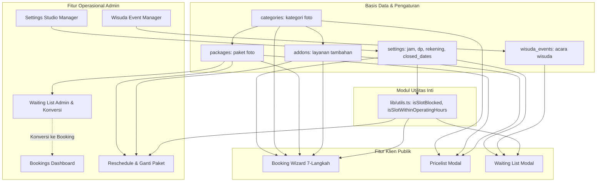

# LAPORAN AUDIT & DOKUMENTASI SISTEM WEBSITE DESARA HOME STUDIO

Laporan ini disusun oleh **Software Analyst** untuk memberikan gambaran menyeluruh mengenai fitur, aturan bisnis, alur kerja, ketergantungan antar fitur, serta inventarisasi kode yang berpotensi tidak terpakai di website Desara Home Studio. Seluruh penjelasan menggunakan bahasa Indonesia yang mudah dipahami tanpa mengorbankan ketepatan teknis.

---

## 1. RINGKASAN EKSEKUTIF

- **Total Fitur Teridentifikasi:** 16 Fitur (terbagi dalam 5 Area: Booking Klien, Waiting List, Pengelolaan Katalog & Studio, Operasional Booking Admin, dan Sistem/Keamanan).
- **Status Pembersihan Kode Mati:** 4 Item kode mati/tidak terpakai telah berhasil dibersihkan (Komponen ShutterTransition, Folder API kosong, Fungsi uploadBuktiTransfer yang dialihkan ke WA, dan 4 Library tak terpakai di package.json).
- **Kondisi Umum Codebase:** Sangat bersih, teroptimasi, dan modern menggunakan Next.js 14 App Router terhubung dengan Supabase. Seluruh pengujian otomatis (automated test), lint, dan build produksi lolos 100%.

---

## 2. TABEL RINGKAS SELURUH FITUR

| No | Nama Fitur | Area | Pengguna | Status | Dipakai? | Kandidat Dihapus? |
|---|---|---|---|---|---|---|
| 1 | Alur Reservasi Foto 7-Langkah (Wizard Booking) | Booking Klien | Pengunjung / Klien | Lengkap | Ya (Tombol Mulai Booking di Beranda) | Tidak |
| 2 | Pemilih Background dengan Preview Foto Portofolio | Booking Klien | Pengunjung / Klien | Lengkap | Ya (Langkah 4 Booking) | Tidak |
| 3 | Kalender Pemilih Tanggal & Pengecekan Hari Libur | Booking Klien | Pengunjung / Klien | Lengkap | Ya (Langkah 4 Booking) | Tidak |
| 4 | Pemilih Slot Jam & Pembatas Kapasitas Non-Overlap | Booking Klien | Pengunjung / Klien | Lengkap | Ya (Langkah 4 Booking) | Tidak |
| 5 | Pop-up Persetujuan Syarat & Ketentuan (S&K) | Booking Klien | Pengunjung / Klien | Lengkap | Ya (Langkah 4 menuju 5) | Tidak |
| 6 | Perhitungan DP & Generator Pesan Konfirmasi WA | Booking Klien | Pengunjung / Klien | Lengkap | Ya (Langkah 5 & 6) | Tidak |
| 7 | Modal Katalog Pricelist Publik | Booking Klien | Pengunjung / Klien | Lengkap | Ya (Tombol 'Lihat Pricelist') | Tidak |
| 8 | Antrean Waiting List Khusus Acara Wisuda | Waiting List | Pengunjung / Klien | Lengkap | Ya (Tombol 'Antrean / Waiting List') | Tidak |
| 9 | Manajemen Acara Wisuda (Wisuda Events) | Waiting List | Admin | Lengkap | Ya (Halaman Admin Waiting List) | Tidak |
| 10 | Konversi Waiting List ke Jadwal Booking Riil | Waiting List | Admin | Lengkap | Ya (Tombol 'Masukkan ke Bookings') | Tidak |
| 11 | Dashboard & Monitoring Jadwal Harian Booking | Admin Operasional | Admin | Lengkap | Ya (Halaman Utama Admin) | Tidak |
| 12 | Atur Ulang Jadwal (Reschedule) & Ganti Paket Foto | Admin Operasional | Admin | Lengkap | Ya (Tombol 'Edit Jadwal & Paket') | Tidak |
| 13 | Pelacak Status Pengerjaan Cetak Foto Klien | Admin Operasional | Admin | Lengkap | Ya di UI | Tidak |
| 14 | Template Otomatis Chat WhatsApp Klien | Admin Operasional | Admin | Lengkap | Ya (Tombol 'Template WA Client') | Tidak |
| 15 | Manajemen Kategori, Paket Foto & Add-on Layanan | Katalog & Studio | Admin | Lengkap | Ya (Menu Paket & Menu Add-on) | Tidak |
| 16 | Pengaturan Studio, Rekening, Jam & Hari Libur | Pengaturan Studio | Admin | Lengkap | Ya (Menu Pengaturan) | Tidak |

---

## 3. LANGKAH 1 - PETA PROYEK

### A. Tech Stack (Teknologi yang Digunakan)
1. **Framework Utama:** **Next.js 14.2.35 (App Router)**
   - Menggunakan model Server Components dan Server Actions (`'use server'`) untuk pengolahan data cepat dan aman di sisi server.
2. **Bahasa Pemrograman:** **TypeScript 5**
   - Menjaga tipe data formulir, skema database, dan keamanan variabel dari kesalahan penulisan kode (*type safety*).
3. **Database & Autentikasi:** **Supabase (PostgreSQL 15+)**
   - Menggunakan `@supabase/ssr` dan `@supabase/supabase-js`.
   - Menggunakan Supabase Auth untuk keamanan login administrator studio.
   - Row Level Security (RLS) diaktifkan untuk melindungi data dari pembacaan liar.
4. **Desain & Antarmuka:** **Tailwind CSS 3.4** didukung oleh `tailwind-merge` dan `clsx`.
5. **Animasi & Transisi:** **Framer Motion 14** untuk efek pergeseran langkah form, pop-up modal, dan *accordion*.
6. **Ikon Grafis:** **Lucide React**.
7. **Manipulasi Waktu & Kalender:** **date-fns 4.4** dengan dukungan format Bahasa Indonesia (`id`).
8. **Pustaka Terpasang tapi Belum Dipakai (Unused Dependencies):**
   - `@tanstack/react-query`, `zod`, `zustand`, `react-hook-form` terpasang di `package.json` namun **tidak ada satupun file di `src/` yang menggunakannya**. Sistem saat ini murni menggunakan *React Native State* (`useState`) dan *Next.js Server Actions*.

---

### B. Struktur Folder dan Fungsinya

```
desara/
├── public/                 # Aset statis gambar logo (logo.png), icon studio
├── src/
│   ├── app/                # Sistem Halaman & Rute (Next.js App Router)
│   │   ├── actions.ts      # Server Actions: Seluruh logika inti database, validasi, dan transaksi
│   │   ├── page.tsx        # Halaman Beranda (Form Booking Klien & Wizard)
│   │   ├── layout.tsx      # Kerangka utama tampilan website publik
│   │   ├── globals.css     # Palet warna studio (Cream, Forest Green, Blitz)
│   │   ├── middleware.ts   # Penjaga rute: Memblokir orang umum masuk halaman /admin tanpa login
│   │   ├── api/            # Folder rute API (kosong, tidak digunakan)
│   │   └── admin/          # Area Khusus Administrator Studio
│   │       ├── layout.tsx  # Layout umum admin
│   │       ├── login/      # Halaman formulir login admin studio
│   │       └── (dashboard)/# Dasbor internal admin setelah login berhasil
│   │           ├── page.tsx        # Redirect otomatis ke /admin/bookings
│   │           ├── bookings/       # Manajemen jadwal pesanan & cetak foto
│   │           ├── waitinglist/    # Manajemen antrean klien & acara wisuda
│   │           ├── packages/       # Manajemen kategori & paket foto
│   │           ├── addons/         # Manajemen add-on layanan
│   │           └── settings/       # Pengaturan rekening, jam buka, hari libur, background
│   ├── components/         # Komponen Antarmuka Pengguna
│   │   ├── ui/             # Tombol (Button) dan Kotak Teks (Input/Textarea) standar
│   │   ├── booking/        # Seluruh komponen formulir pemesanan klien (Langkah 1 s/d 7)
│   │   └── admin/          # Komponen tabel, modal edit, kalender admin, template WA
│   ├── lib/                # Fungsi Bantu & Utilitas Sistem
│   │   ├── constants.ts    # Batas kapasitas booking per slot jam
│   │   ├── utils.ts        # Kalkulator slot jam, rupiah, filter overlap, pembuat link WA
│   │   └── supabase/       # Inisialisasi koneksi browser & server ke Supabase
│   └── types/              # Definisi struktur data TypeScript (Booking, Package, dll)
├── supabase/               # Berkas Database
│   ├── migrations/         # Skrip SQL pembentukan tabel (001 s/d 004)
│   └── seed.sql            # Data contoh awal (kategori, paket wisuda, add-on)
└── tests/                  # Pengujian Otomatis
    └── slot-availability.test.ts # Uji coba logika aturan jam bentrok & jam tutup
```

---

### C. Daftar Seluruh Halaman / Route

| Jenis Route | Jalur (URL) | Deskripsi & Hak Akses |
|---|---|---|
| **Publik** | `/` | Halaman beranda utama tempat pengunjung melihat sambutan studio, membuka katalog pricelist, mendaftar waiting list wisuda, serta menyelesaikan reservasi sesi foto. |
| **Admin** | `/admin/login` | Halaman login admin. Jika sudah login otomatis dialihkan ke dasbor. |
| **Admin** | `/admin` | Jalur pintas yang otomatis mengalihkan admin ke `/admin/bookings`. |
| **Admin** | `/admin/bookings` | Dasbor utama admin untuk melihat daftar jadwal booking yang masuk, mengonfirmasi booking, menandai selesai, membatalkan, mereschedule jadwal/ganti paket, mengecek status cetak, dan membuka template WhatsApp. |
| **Admin** | `/admin/waitinglist` | Halaman antrean waiting list klien sekaligus manajemen jadwal acara wisuda kampus. Memungkinkan admin mengonversi antrean menjadi booking sah dengan sekali klik. |
| **Admin** | `/admin/packages` | Halaman kelola kategori foto (Wisuda, Prewedding, dll) dan paket foto beserta rincian harga, durasi, dan fasilitas. |
| **Admin** | `/admin/addons` | Halaman kelola layanan tambahan (tambah waktu, orang, cetak, background) serta pengaturannya per kategori. |
| **Admin** | `/admin/settings` | Halaman konfigurasi studio: nama studio, rekening pembayaran, nominal minimal DP, jam operasional, upload foto preview background, dan penentuan tanggal libur studio. |
| **API** | `/api/bookings` | *Folder kosong* (Tidak ada file `route.ts`). |
| **API** | `/api/slots` | *Folder kosong* (Tidak ada file `route.ts`). |

---

### D. Daftar Tabel Database Beserta Kolom Pentingnya

1. **`settings`** (Menyimpan seluruh konfigurasi dinamis studio)
   - `key` (Teks, Kunci Utama): Nama konfigurasi (cth: `nama_studio`, `jam_buka`, `jam_tutup`, `rekening_bni`, `dp_minimal`, `backgrounds`, `closed_dates`, `tampilkan_waiting`).
   - `value` (JSONB): Nilai konfigurasi dalam format fleksibel.
   - `updated_at` (Waktu): Terakhir diperbarui.

2. **`categories`** (Kategori jenis pemotretan)
   - `id` (UUID, Kunci Utama): ID unik kategori.
   - `nama` (Teks): Nama kategori (cth: Wisuda, Prewedding, Keluarga, Portrait).
   - `slug` (Teks Unik): Teks URL ramah mesin pencari.
   - `urutan` (Angka): Posisi urutan tampil.
   - `aktif` (Boolean): Status aktif/nonaktif di formulir klien.

3. **`packages`** (Paket pemotretan yang ditawarkan)
   - `id` (UUID, Kunci Utama), `category_id` (Relasi ke tabel categories).
   - `nama` (Teks): Nama paket (cth: Bronze, Silver).
   - `harga` (Angka): Biaya paket dalam satuan Rupiah.
   - `durasi_menit` (Angka): Alokasi waktu foto (cth: 30, 45, 60 menit).
   - `jumlah_pilihan_background` (Angka): Kuota warna background gratis.
   - `maks_orang` (Angka): Kapasitas orang yang diperbolehkan masuk studio.
   - `cetak_ukuran` & `cetak_jumlah` (Teks & Angka): Fasilitas cetak foto (cth: 12R sebanyak 1 lembar).
   - `bonus` (Teks): Keterangan bonus (cth: All softfile).
   - `aktif` (Boolean): Menentukan apakah paket bisa dipilih klien.

4. **`addons`** & **`addon_categories`** (Layanan tambahan berbayar)
   - `id` (UUID, Kunci Utama), `jenis` (Pilihan: `waktu`, `background`, `orang`, `cetak`).
   - `nama` (Teks): Nama add-on (cth: Tambah Waktu, Tambah Background, Cetak 10R).
   - `satuan` (Teks): Label penambahan (cth: +15 menit, +1 lembar).
   - `harga` (Angka): Biaya satuan add-on.
   - `maks` (Angka): Batas maksimal penambahan oleh klien dalam satu sesi.
   - `addon_categories`: Tabel perantara untuk mengatur add-on apa saja yang muncul di kategori tertentu.

5. **`bookings`** (Tabel transaksi reservasi klien)
   - `id` (UUID, Kunci Utama), `kode` (Teks Unik): Kode booking otomatis (format: `DSR-YYYYMMDD-001`).
   - `nama_klien`, `wa_klien`, `kampus` (Teks): Identitas pemesan.
   - `tanggal` (Tanggal) & `jam_mulai` (Waktu): Waktu reservasi sesi foto.
   - `durasi_total` (Angka): Total waktu (durasi paket + add-on waktu).
   - `category_nama`, `package_nama`, `package_harga`, `package_snapshot` (Data beku saat reservasi dibuat agar tidak berubah meski admin mengubah harga paket di kemudian hari).
   - `total_harga` (Angka): Total paket + add-on.
   - `dp_dibayar` (Angka): Nominal uang muka yang dibayarkan klien.
   - `sisa_pelunasan` (Angka Terhitung Otomatis): `total_harga - dp_dibayar`.
   - `pilihan_background` (Array Teks): Daftar warna latar yang dipilih.
   - `bukti_transfer` (Teks): Nama file bukti jika ada.
   - `status` (Pilihan: `pending`, `booking`, `selesai`, `dibatalkan`).
   - `status_cetak` (Pilihan: `menunggu`, `proses`, `selesai`): Pelacak cetak foto.

6. **`booking_addons`** (Rincian add-on yang dibeli pada setiap booking)
   - Menyimpan salinan nama add-on, harga saat itu, jumlah yang diambil, dan total harga (`harga * jumlah`).

7. **`booking_status_log`** (Buku catatan riwayat perubahan status booking)
   - Mencatat waktu perubahan, status sebelum, status sesudah, admin yang mengubah, dan keterangan alasan (cth: saat jadwal di-reschedule).

8. **`wisuda_events`** (Daftar agenda wisuda kampus)
   - `id` (UUID, Kunci Utama), `nama` (Teks: cth. "Wisuda UNTAN Oktober 2026"), `kampus` (Teks), `keterangan` (Teks), `aktif` (Boolean).

9. **`waiting_list`** (Daftar antrean klien)
   - `id` (UUID, Kunci Utama), `nama`, `wa`, `kampus`, `category_nama`, `package_nama`.
   - `acara_id` (Relasi ke wisuda_events): Acara wisuda yang dipilih klien.
   - `acara_nama` (Teks): Nama acara wisuda saat pendaftaran.
   - `tanggal_ingin` & `jam_ingin`: Preferensi waktu sesi klien.
   - `catatan` (Teks): Format gabungan berisi rincian jam, DP, kampus, dan penanda kode booking hasil konversi.
   - `sudah_dihubungi` (Boolean): Penanda apakah admin telah menindaklanjuti klien ini.

---

## 4. LANGKAH 2 - INVENTARISASI FITUR LENGKAP

### [Fitur 1: Alur Reservasi Foto 7-Langkah (Wizard Booking)]
- **Tujuan:** Memandu pengunjung website melakukan pemesanan sesi foto secara bertahap, nyaman, dan terstruktur tanpa kebingungan.
- **Siapa yang memakai:** Pengunjung / Klien studio.
- **Lokasi kode:** [`src/components/booking/BookingWizard.tsx`](file:///Users/utihirzy/Documents/Web/desara/src/components/booking/BookingWizard.tsx), didukung komponen `Step1Welcome` s/d `Step7Sukses`.
- **Alur logika (step by step):**
  1. *Langkah 1 (Welcome):* Menampilkan logo, nama studio, jam buka, tombol 'Mulai Booking', 'Lihat Pricelist', dan 'Antrean / Waiting List'.
  2. *Langkah 2 (Nama):* Klien memasukkan nama lengkap (wajib diisi).
  3. *Langkah 3 (Kategori):* Klien memilih jenis foto (Wisuda, Prewedding, dll).
  4. *Langkah 4 (Paket):* Klien memilih paket foto yang aktif pada kategori tersebut.
  5. *Langkah 5 (Form Detail):* Klien memilih warna background sesuai kuota paket, memilih tanggal di kalender interaktif, memilih slot jam mulai yang tersedia, mengisi nomor WhatsApp, kampus (opsional), catatan, dan memilih add-on tambahan jika diinginkan.
  6. *Validasi S&K:* Saat menekan 'Pembayaran', muncul pop-up Syarat & Ketentuan Studio yang mewajibkan klien mencentang persetujuan sebelum dapat lanjut.
  7. *Langkah 6 (Pembayaran):* Menampilkan nomor rekening BNI studio, rincian biaya, kalkulator sisa pelunasan, input nominal transfer DP (minimal Rp 100.000), serta instruksi pengiriman bukti pembayaran via WhatsApp.
  8. *Langkah 7 (Sukses):* Database menyimpan booking berstatus *pending*, menampilkan Kode Booking resmi, ringkasan pesanan, dan tombol langsung ke WhatsApp admin studio yang otomatis menyusun draft pesan konfirmasi.
- **Data yang dibaca/ditulis:** Membaca tabel `settings`, `categories`, `packages`, `addons`. Menulis baris baru ke tabel `bookings`, `booking_addons`, dan `booking_status_log`.
- **Ketergantungan:** Server action `submitBooking` di [`src/app/actions.ts`](file:///Users/utihirzy/Documents/Web/desara/src/app/actions.ts#L66).
- **Input & output:** Input berupa data diri, paket, add-on, jadwal. Output berupa data booking tersimpan dengan kode unik (cth: `DSR-20261008-001`).
- **Status kelengkapan:** Lengkap & Berfungsi Normal.
- **Bukti pemakaian:** Tombol utama "Mulai Booking" di halaman beranda.

---

### [Fitur 2: Pemilih Background dengan Preview Foto Asli Studio]
- **Tujuan:** Membantu klien memilih kombinasi warna latar foto dengan melihat foto asli hasil studio nyata, bukan sekadar melihat nama warna.
- **Siapa yang memakai:** Klien saat melakukan reservasi.
- **Lokasi kode:** [`src/components/booking/BackgroundSelector.tsx`](file:///Users/utihirzy/Documents/Web/desara/src/components/booking/BackgroundSelector.tsx).
- **Alur logika:**
  - Mengambil daftar warna background dari pengaturan database.
  - Jika admin sudah mengunggah foto contoh asli, sistem menampilkan foto tersebut dengan efek hover perbesaran dan lencana 'Foto Asli Studio'.
  - Jika belum ada foto unggahan, sistem menggunakan gradien warna studio yang elegan.
  - Membatasi jumlah pilihan tepat sesuai kuota (`pkg.jumlah_pilihan_background` + add-on background yang dibeli).
  - Menandai nomor urutan pemilihan background (#1, #2) secara visual.
- **Data yang dibaca/ditulis:** Membaca array `backgrounds` di tabel `settings`. Pilihan disimpan ke kolom `pilihan_background` di tabel `bookings`.
- **Ketergantungan:** Komponen `Step5Form.tsx`.
- **Input & output:** Input klik warna latar. Output berupa array teks warna yang divalidasi tidak boleh kurang atau lebih dari kuota paket.
- **Status kelengkapan:** Lengkap & Sangat Interaktif.
- **Bukti pemakaian:** Muncul di Langkah 4 formulir booking.

---

### [Fitur 3: Kalender Pemilih Tanggal & Pengecekan Hari Libur Studio]
- **Tujuan:** Mencegah klien memilih tanggal di masa lalu atau tanggal di mana studio sedang tutup/libur.
- **Siapa yang memakai:** Klien saat booking dan Admin saat reschedule.
- **Lokasi kode:** [`src/components/booking/ModernDatePicker.tsx`](file:///Users/utihirzy/Documents/Web/desara/src/components/booking/ModernDatePicker.tsx).
- **Alur logika:**
  - Menampilkan kalender visual bulanan berbasis zona waktu lokal.
  - Membaca daftar tanggal libur studio (`closed_dates`) dari database. Tanggal yang ditandai tutup diberi warna merah muda, dicoret (*line-through*), dan tidak dapat diklik.
  - Tanggal sebelum hari ini (*past dates*) otomatis dinonaktifkan.
  - Di bagian bawah kalender terdapat legenda keterangan alasan studio tutup (cth: "Libur Bersama", "Renovasi").
- **Data yang dibaca/ditulis:** Membaca kunci `closed_dates` dari tabel `settings`.
- **Ketergantungan:** Library `date-fns`.
- **Input & output:** Input klik tanggal. Output berupa string format tanggal `YYYY-MM-DD`.
- **Status kelengkapan:** Lengkap.
- **Bukti pemakaian:** Dipakai di Form Booking klien, Modal Reschedule Admin, dan Modal Konversi Waiting List Admin.

---

### [Fitur 4: Pemilih Slot Jam & Aturan Non-Overlap Studio]
- **Tujuan:** Menyediakan jam pemotretan yang valid dan mencegah bentrok jadwal pada jam mulai yang sama.
- **Siapa yang memakai:** Klien dan Admin.
- **Lokasi kode:** [`src/components/booking/TimeSlotSelector.tsx`](file:///Users/utihirzy/Documents/Web/desara/src/components/booking/TimeSlotSelector.tsx), fungsi `getAvailableSlots` di `actions.ts`, serta utilitas di [`src/lib/utils.ts`](file:///Users/utihirzy/Documents/Web/desara/src/lib/utils.ts#L72-L147).
- **Alur logika:**
  - Studio menghasilkan rentang slot dari `jam_buka` s/d `jam_tutup` dengan interval tertentu (default per 30 menit).
  - Slot jam dikelompokkan ke dalam kategori waktu: Pagi (08:00 - 11:30), Siang (12:00 - 14:30), dan Sore/Malam (15:00 - 20:00).
  - Setiap slot menampilkan jam mulai dan estimasi jam selesai (`jam_mulai + durasi_total`).
  - **Aturan Non-Overlap:** Sesuai aturan studio yang diuji di unit test, slot dianggap penuh BUKAN karena durasi menyeberang ke slot berikutnya, melainkan HANYA jika jam mulainya persis sama dan sudah mencapai kapasitas maksimal (`MAX_BOOKING_PER_SLOT = 1`). *Contoh: Booking jam 13:00 durasi 45 menit tidak memblokir slot jam 13:30.*
  - **Aturan Batas Tutup:** Slot yang jam selesainya melebihi jam tutup studio (misal mulai 19:30 dengan durasi 45 menit, selesai 20:15 padahal studio tutup jam 20:00) otomatis diblokir/dihilangkan.
- **Data yang dibaca/ditulis:** Membaca booking berstatus `pending` dan `booking` pada tanggal bersangkutan dari tabel `bookings`.
- **Ketergantungan:** Unit test [`tests/slot-availability.test.ts`](file:///Users/utihirzy/Documents/Web/desara/tests/slot-availability.test.ts).
- **Input & output:** Input pilihan tanggal dan durasi. Output daftar slot jam yang masih bisa dipesan.
- **Status kelengkapan:** Lengkap & Teruji dengan *Automated Test*.
- **Bukti pemakaian:** Dipakai di Form Booking dan Reschedule Admin.

---

### [Fitur 5: Pop-up Persetujuan Syarat & Ketentuan (S&K)]
- **Tujuan:** Memastikan klien memahami 5 aturan penting studio (kebijakan DP hangus jika batal sepihak, kewajiban hadir 10-15 menit lebih awal, batas waktu reschedule maksimal H-2, penjagaan properti studio, dan pengiriman file foto) sebelum melakukan pembayaran.
- **Siapa yang memakai:** Klien pemesan.
- **Lokasi kode:** [`src/components/booking/Step5Form.tsx`](file:///Users/utihirzy/Documents/Web/desara/src/components/booking/Step5Form.tsx#L419-L587).
- **Alur logika:**
  - Saat klien menekan tombol 'Pembayaran' di Langkah 4, sistem memvalidasi kelengkapan form.
  - Jika valid, modal pop-up S&K muncul menutupi layar dengan 5 butir poin resmi studio.
  - Tombol 'Lanjut ke Pembayaran' dinonaktifkan (terkunci) hingga kotak centang *"Saya menerima & menyetujui seluruh S&K Studio"* dicentang oleh klien.
- **Data yang dibaca/ditulis:** Komponen antarmuka murni di sisi browser.
- **Ketergantungan:** Framer Motion.
- **Input & output:** Input centang persetujuan. Output mengizinkan klien masuk ke langkah transfer pembayaran.
- **Status kelengkapan:** Lengkap.
- **Bukti pemakaian:** Wajib dilewati setiap klien sebelum bisa transfer DP.

---

### [Fitur 6: Perhitungan DP & Generator Pesan Konfirmasi WhatsApp]
- **Tujuan:** Menghitung sisa pembayaran pelunasan di studio dan otomatis menyusun teks pesan konfirmasi WhatsApp yang rapi dan terisi lengkap untuk dikirimkan ke admin studio.
- **Siapa yang memakai:** Klien studio.
- **Lokasi kode:** [`src/components/booking/Step6Pembayaran.tsx`](file:///Users/utihirzy/Documents/Web/desara/src/components/booking/Step6Pembayaran.tsx), [`Step7Sukses.tsx`](file:///Users/utihirzy/Documents/Web/desara/src/components/booking/Step7Sukses.tsx), dan fungsi `buildWAMessage` di `utils.ts`.
- **Alur logika:**
  - Klien memasukkan nominal DP yang ditransfer (minimal Rp 100.000 atau sesuai nilai `dp_minimal` studio).
  - Sistem menampilkan tombol salin nomor rekening BNI beserta nama pemilik rekening.
  - Setelah booking disimpan, halaman sukses menghasilkan link WhatsApp (`https://wa.me/...`) yang berisi rincian: Kode Booking, Nama, Paket, Tanggal, Jam, Total Biaya, DP Dibayar, dan Sisa Pelunasan. Klien hanya perlu menekan tombol untuk membuka WhatsApp dan melampirkan screenshot bukti transfer.
- **Data yang dibaca/ditulis:** Membaca `settings` (rekening dan nomor WA admin). Menulis ke tabel `bookings`.
- **Ketergantungan:** Aplikasi WhatsApp / WhatsApp Web.
- **Input & output:** Input nominal DP. Output tautan kirim pesan WhatsApp otomatis.
- **Status kelengkapan:** Lengkap.
- **Bukti pemakaian:** Tombol "Kirim Bukti Transfer ke Admin via WA" di langkah terakhir booking.

---

### [Fitur 7: Modal Katalog Pricelist Publik]
- **Tujuan:** Memudahkan calon klien melihat daftar paket foto, harga, rincian fasilitas (durasi, jumlah background, maks orang, cetak, bonus), dan harga add-on dalam satu pop-up tanpa harus mengisi data formulir terlebih dahulu.
- **Siapa yang memakai:** Pengunjung website.
- **Lokasi kode:** [`src/components/booking/PricelistModal.tsx`](file:///Users/utihirzy/Documents/Web/desara/src/components/booking/PricelistModal.tsx).
- **Alur logika:**
  - Mengelompokkan tampilan ke dalam 2 tab: "Paket Foto" dan "Layanan Tambahan / Add-ons".
  - Memiliki filter pil (*pills*) berdasarkan kategori foto (Wisuda, Prewedding, dll).
  - Terdapat tombol "Pilih Paket Ini" pada setiap kartu paket yang jika diklik langsung mengarahkan klien ke formulir pemesanan dengan paket tersebut sudah terpilih otomatis.
- **Data yang dibaca/ditulis:** Membaca data `categories`, `packages`, `addons`, dan `addon_categories`.
- **Ketergantungan:** Framer Motion.
- **Input & output:** Navigasi klik kategori. Output pemilihan paket langsung ke formulir.
- **Status kelengkapan:** Lengkap.
- **Bukti pemakaian:** Tombol "Lihat Pricelist" di beranda website.

---

### [Fitur 8: Antrean Waiting List Khusus Acara Wisuda]
- **Tujuan:** Mengakomodasi klien yang ingin memesan sesi foto pada acara wisuda tertentu di mana slot jam dikunci secara eksklusif per acara wisuda kampus.
- **Siapa yang memakai:** Pengunjung / Mahasiswa yang akan wisuda.
- **Lokasi kode:** [`src/components/booking/WaitingListModal.tsx`](file:///Users/utihirzy/Documents/Web/desara/src/components/booking/WaitingListModal.tsx).
- **Alur logika:**
  - Klien memilih Kategori Foto, Paket Foto, mengisi Nama, Kampus, dan WhatsApp.
  - Klien memilih Acara Wisuda yang sedang dibuka oleh admin (cth: "Wisuda UNTAN Oktober 2026").
  - Sistem menampilkan slot jam operasional. Jam yang sudah dipilih oleh klien lain pada acara wisuda yang sama akan ditandai dengan ikon gembok kuning bertuliskan **"Terambil"** dan tidak dapat diklik.
  - Setelah terdaftar, sistem menampilkan nomor rekening untuk transfer DP waiting list (Rp 100.000) dan tombol kirim bukti transfer ke WhatsApp admin.
- **Data yang dibaca/ditulis:** Membaca `wisuda_events` dan `waiting_list`. Menulis baris baru ke tabel `waiting_list`.
- **Ketergantungan:** Server action `submitWaitingList` dan `getWisudaSlotStatus`.
- **Input & output:** Input data diri, acara wisuda, dan jam. Output status antrean terdaftar dan terkunci untuk acara tersebut.
- **Status kelengkapan:** Lengkap.
- **Bukti pemakaian:** Tombol "Antrean / Waiting List" di beranda website (dapat diaktifkan/dinonaktifkan oleh admin dari pengaturan).

---

### [Fitur 9: Manajemen Acara Wisuda (Wisuda Events)]
- **Tujuan:** Tempat bagi admin studio membuat, mengedit nama/kampus/keterangan, mengaktifkan/menonaktifkan, dan menghapus daftar acara wisuda kampus.
- **Siapa yang memakai:** Administrator studio.
- **Lokasi kode:** [`src/components/admin/WisudaEventManager.tsx`](file:///Users/utihirzy/Documents/Web/desara/src/components/admin/WisudaEventManager.tsx).
- **Alur logika:**
  - Admin dapat menambahkan acara baru dengan mengisi Nama Acara (wajib), Kampus (wajib), dan Keterangan (opsional).
  - Terdapat tombol saklar (*toggle*) untuk mengaktifkan atau menonaktifkan acara. Acara yang dinonaktifkan tidak akan muncul di form pendaftaran klien.
  - Tombol edit untuk mengubah nama/keterangan, dan tombol hapus acara.
- **Data yang dibaca/ditulis:** Tabel `wisuda_events`.
- **Ketergantungan:** Server actions: `createWisudaEvent`, `updateWisudaEvent`, `deleteWisudaEvent`.
- **Input & output:** Input form acara. Output acara tersimpan di database.
- **Status kelengkapan:** Lengkap.
- **Bukti pemakaian:** Muncul di bagian atas halaman `/admin/waitinglist`.

---

### [Fitur 10: Konversi Waiting List ke Jadwal Booking Riil]
- **Tujuan:** Mengubah data klien dari antrean waiting list menjadi jadwal pemesanan sah (*official booking*) dengan satu klik tanpa perlu admin mengetik ulang nama, nomor telepon, kampus, paket, dan jam sesi foto.
- **Siapa yang memakai:** Administrator studio.
- **Lokasi kode:** [`src/components/admin/WaitingListClient.tsx`](file:///Users/utihirzy/Documents/Web/desara/src/components/admin/WaitingListClient.tsx#L40-L181), fungsi `convertWaitingListToBooking` di `actions.ts`.
- **Alur logika:**
  - Admin menekan tombol "Masukkan ke Bookings" pada kartu klien di daftar waiting list.
  - Muncul modal konfirmasi yang menampilkan ringkasan data pemesan, paket yang dipilih, dan jam sesi.
  - Admin memilih tanggal fix sesi foto menggunakan kalender interaktif.
  - Sistem membuat baris pemesanan baru di tabel `bookings` dengan status awal `pending`, merekam snapshot paket foto, menghasilkan kode booking resmi (cth: `DSR-20261008-002`), dan menambahkan penanda di catatan waiting list `[Sudah Masuk Booking: DSR-...]`.
  - Kartu waiting list klien tersebut berubah tampilan menjadi hijau bertuliskan *"Sudah Masuk Bookings"* dan tombolnya berubah menjadi *"Lihat di Bookings"*.
- **Data yang dibaca/ditulis:** Membaca `waiting_list` dan `packages`. Menulis ke `bookings`, `booking_status_log`, dan mengupdate `waiting_list`.
- **Ketergantungan:** Server action `convertWaitingListToBooking`.
- **Input & output:** Input ID waiting list dan tanggal pemotretan. Output baris baru di tabel `bookings`.
- **Status kelengkapan:** Lengkap & Sangat Memudahkan Operasional.
- **Bukti pemakaian:** Tombol biru "Masukkan ke Bookings" pada setiap kartu waiting list.

---

### [Fitur 11: Dashboard & Monitoring Jadwal Harian Booking]
- **Tujuan:** Memantau seluruh pemesanan foto yang masuk, jadwal sesi hari ini, memfilter berdasarkan status pembayaran/cetak/tanggal, serta mencari data klien secara instan.
- **Siapa yang memakai:** Administrator studio.
- **Lokasi kode:** [`src/app/admin/(dashboard)/bookings/page.tsx`](file:///Users/utihirzy/Documents/Web/desara/src/app/admin/%28dashboard%29/bookings/page.tsx) dan [`BookingsClient.tsx`](file:///Users/utihirzy/Documents/Web/desara/src/components/admin/BookingsClient.tsx).
- **Alur logika:**
  - Menampilkan ringkasan sesi foto hari ini (*Timeline Jadwal Harian*) dalam bentuk kartu mini berurutan berdasarkan jam mulai.
  - Pencarian fleksibel berdasarkan nama klien atau kode booking.
  - Filter cepat: Status booking (Menunggu, Dikonfirmasi, Selesai, Dibatalkan), Filter cetak foto (Ada cetak, Belum, Proses, Selesai), dan Kalender pemilih tanggal.
  - Kartu booking mengusung sistem akordion (*accordion*): tampilan luar ringkas, jika diklik akan membuka detail durasi, WhatsApp, background, catatan, tombol lihat bukti transfer, status cetak, dan tombol aksi status.
- **Data yang dibaca/ditulis:** Membaca tabel `bookings` dan `booking_addons`. Menulis perubahan status ke `bookings` dan `booking_status_log`.
- **Ketergantungan:** Server actions: `updateBookingStatus`, `deleteBooking`.
- **Input & output:** Filter dan pencarian data booking.
- **Status kelengkapan:** Lengkap.
- **Bukti pemakaian:** Halaman utama setelah admin login (`/admin/bookings`).

---

### [Fitur 12: Atur Ulang Jadwal (Reschedule) & Ganti Paket Foto Admin]
- **Tujuan:** Mengizinkan admin mengubah tanggal, jam sesi foto, atau mengganti paket foto klien jika terjadi perubahan rencana atas permintaan klien.
- **Siapa yang memakai:** Administrator studio.
- **Lokasi kode:** [`src/components/admin/RescheduleModal.tsx`](file:///Users/utihirzy/Documents/Web/desara/src/components/admin/RescheduleModal.tsx), fungsi `updateBookingSchedule` di `actions.ts`.
- **Alur logika:**
  - Admin mengklik tombol "Edit Jadwal & Paket" pada detail booking.
  - Admin dapat memilih paket foto baru dari kategori mana pun. Sistem otomatis mengkalkulasi ulang harga total dan durasi baru sesuai paket baru tersebut (dengan tetap memperhitungkan add-on yang sudah dibeli).
  - Admin dapat memilih tanggal baru di kalender dan jam baru yang tersedia (sistem memvalidasi ketersediaan slot jam baru agar tidak bentrok dengan booking lain).
  - Admin mengisi catatan alasan perubahan jadwal.
  - Sistem memperbarui data booking dan mencatat log riwayat perubahan ke tabel `booking_status_log`.
- **Data yang dibaca/ditulis:** Membaca `packages`, `categories`, `bookings`. Mengupdate tabel `bookings` dan menyisipkan catatan ke `booking_status_log`.
- **Ketergantungan:** Server action `updateBookingSchedule`.
- **Input & output:** Input tanggal baru, jam baru, paket baru, keterangan. Output jadwal booking terupdate tanpa merusak add-on yang sudah ada.
- **Status kelengkapan:** Lengkap.
- **Bukti pemakaian:** Tombol "Edit Jadwal & Paket" pada setiap kartu booking.

---

### [Fitur 13: Pelacak Status Pengerjaan Cetak Foto Klien]
- **Tujuan:** Memantau proses pengerjaan cetak foto fisik klien dari tahap belum dicetak, sedang dicetak di lab/vendor, hingga selesai siap diambil.
- **Siapa yang memakai:** Administrator studio.
- **Lokasi kode:** [`src/components/admin/BookingsClient.tsx`](file:///Users/utihirzy/Documents/Web/desara/src/components/admin/BookingsClient.tsx#L241-L311), fungsi `updateCetakStatus` di `actions.ts`.
- **Alur logika:**
  - Sistem mendeteksi otomatis apakah paket foto atau add-on yang dibeli klien mengandung fasilitas cetak (misal cetak 12R atau add-on cetak 4R/10R).
  - Jika ada cetakan, kartu booking memunculkan kontrol status 3 tingkat: **Belum** (kuning), **Proses** (ungu), dan **Selesai** (hijau).
  - Admin dapat mengubah status cetak hanya dengan mengklik salah satu tombol tersebut. Perubahan langsung tercatat di log riwayat.
- **Data yang dibaca/ditulis:** Membaca dan memperbarui kolom `status_cetak` pada tabel `bookings`.
- **Ketergantungan:** Server action `updateCetakStatus`.
- **Input & output:** Klik status cetak. Output status cetak terupdate di kartu dan database.
- **Status kelengkapan:** *Setengah jadi / Perlu verifikasi migrasi database*. (Secara kode TypeScript dan Server Action sudah berfungsi sempurna, namun di file SQL migrasi `001_initial.sql` kolom `status_cetak` belum tertulis di definisi `CREATE TABLE bookings`. Kolom ini kemungkinan ditambahkan manual di Supabase dashboard atau perlu dipastikan ketersediaannya di database riil).
- **Bukti pemakaian:** Tombol opsi status cetak di kartu booking klien yang memiliki fasilitas cetak.

---

### [Fitur 14: Template Otomatis Chat WhatsApp Klien]
- **Tujuan:** Mempercepat komunikasi admin ke klien tanpa perlu mengetik ulang pesan panjang, mencakup 4 skenario pesan standar studio.
- **Siapa yang memakai:** Administrator studio.
- **Lokasi kode:** [`src/components/admin/WhatsAppTemplateModal.tsx`](file:///Users/utihirzy/Documents/Web/desara/src/components/admin/WhatsAppTemplateModal.tsx).
- **Alur logika:**
  - Admin menekan tombol "Template WA Client".
  - Tersedia 4 tab template pesan yang variabelnya (nama, paket, tanggal, jam, sisa bayar, rincian cetak) sudah terisi otomatis:
    1. *Konfirmasi Booking:* Mengabarkan bahwa reservasi telah dikonfirmasi dan merinci sisa pelunasan.
    2. *Reminder Hari H:* Pengingat jadwal sesi pemotretan beberapa jam sebelum sesi dimulai.
    3. *Kirim Link Foto:* Pesan penyerahan hasil foto Google Drive yang dilengkapi kolom input link tautan.
    4. *Pengambilan Cetakan:* Mengabarkan bahwa hasil cetak foto fisik sudah selesai dan siap diambil di studio.
  - Admin dapat menekan tombol "Salin Teks" atau tombol "Buka Chat WhatsApp" yang langsung membuka aplikasi WA menuju nomor klien.
- **Data yang dibaca/ditulis:** Membaca data booking yang sedang dibuka.
- **Ketergantungan:** Komponen antarmuka murni di sisi browser.
- **Input & output:** Input pilihan tab dan link drive opsional. Output teks format WhatsApp siap kirim.
- **Status kelengkapan:** Lengkap & Sangat Efisien.
- **Bukti pemakaian:** Tombol hijau "Template WA Client" di setiap kartu booking.

---

### [Fitur 15: Manajemen Kategori, Paket Foto & Add-on Layanan]
- **Tujuan:** Memberikan kendali penuh kepada admin untuk mengatur daftar paket harga foto, durasi, batasan orang, fasilitas cetak, serta layanan add-on tambahan tanpa menyentuh kode program.
- **Siapa yang memakai:** Administrator studio.
- **Lokasi kode:** [`src/components/admin/PackagesClient.tsx`](file:///Users/utihirzy/Documents/Web/desara/src/components/admin/PackagesClient.tsx) dan [`AddonsClient.tsx`](file:///Users/utihirzy/Documents/Web/desara/src/components/admin/AddonsClient.tsx).
- **Alur logika:**
  - Admin dapat menambah, mengedit, menonaktifkan, atau menghapus kategori foto dan paket foto.
  - Admin dapat menambah add-on baru dengan jenis `waktu`, `background`, `orang`, atau `cetak`, menentukan harga per satuan, dan memilih add-on tersebut aktif untuk kategori mana saja.
- **Data yang dibaca/ditulis:** Tabel `categories`, `packages`, `addons`, `addon_categories`.
- **Ketergantungan:** Supabase Client Browser.
- **Input & output:** Form input data paket dan add-on. Output pembaruan katalog studio.
- **Status kelengkapan:** Lengkap.
- **Bukti pemakaian:** Menu 'Paket' dan Menu 'Add-on' pada navigasi samping admin.

---

### [Fitur 16: Pengaturan Studio, Rekening, Jam & Hari Libur]
- **Tujuan:** Pusat pengaturan operasional studio untuk mengubah informasi umum, nomor rekening BNI, nominal DP minimal, jam buka/tutup studio, mengunggah foto contoh background, dan mengatur tanggal libur studio.
- **Siapa yang memakai:** Administrator studio.
- **Lokasi kode:** [`src/components/admin/SettingsClient.tsx`](file:///Users/utihirzy/Documents/Web/desara/src/components/admin/SettingsClient.tsx).
- **Alur logika:**
  - Pengaturan umum: Admin mengisi nama studio, teks sambutan, nomor WA, rekening BNI, nama rekening, dan DP minimal.
  - Jam Operasional: Menentukan jam buka (cth: 08:00), jam tutup (cth: 20:00), dan interval slot (30 menit).
  - Background & Portofolio: Admin dapat menambah warna background baru dan mengunggah file foto asli studio (`.jpg`, `.png`, `.webp`) yang otomatis tersimpan ke Supabase Storage bucket `backgrounds`.
  - Jadwal Libur Studio (`closed_dates`): Admin dapat memilih tanggal di kalender dan mengisi keterangan alasan tutup (cth: "Libur Lebaran", "Renovasi"). Tanggal ini otomatis terblokir di formulir klien.
  - Saklar Waiting List: Menyalakan atau mematikan tombol waiting list di beranda.
- **Data yang dibaca/ditulis:** Tabel `settings` dan Supabase Storage bucket `backgrounds`.
- **Ketergantungan:** Server actions: `updateSetting`, `uploadBackgroundImage`.
- **Input & output:** Form pengaturan dan unggah file gambar. Output konfigurasi tersimpan dan terapkan secara langsung di seluruh website.
- **Status kelengkapan:** Lengkap.
- **Bukti pemakaian:** Menu 'Pengaturan' pada navigasi samping admin.

---

## 5. LANGKAH 3 - RANGKUMAN LOGIKA BISNIS

Berikut adalah aturan bisnis yang tertanam di dalam kode program:

### 1. Aturan Penjadwalan & Ketersediaan Slot Jam
- **Jam Operasional Default:** Buka pukul `08:00` WIB dan Tutup pukul `20:00` WIB.
- **Interval Slot Default:** `30 menit` (menghasilkan slot: 08:00, 08:30, 09:00, ..., 19:30).
- **Aturan Bentrok Non-Overlap:** Sesuai implementasi pada file [`src/lib/utils.ts`](file:///Users/utihirzy/Documents/Web/desara/src/lib/utils.ts#L98) dan tes [`slot-availability.test.ts`](file:///Users/utihirzy/Documents/Web/desara/tests/slot-availability.test.ts), sebuah slot jam dinyatakan **PENUH/TERBLOKIR** jika ada booking lain yang memiliki **waktu mulai (start time) yang sama persis** dan kapasitas sudah mencapai batas (`MAX_BOOKING_PER_SLOT = 1`). Durasi pemotretan yang memanjang ke slot berikutnya sengaja tidak memblokir slot jam berikutnya (misal: booking jam 13:00 durasi 45 menit tetap membiarkan slot 13:30 tersedia).
- **Aturan Jam Tutup Studio:** Waktu mulai ditambah durasi total pemotretan **TIDAK BOLEH melebihi jam tutup studio**. Slot jam 19:30 dengan durasi 45 menit (selesai 20:15) akan otomatis ditolak dan tidak ditampilkan.
- **Aturan Hari Libur Studio:** Tanggal yang terdaftar dalam `closed_dates` di tabel `settings` ditutup total; pemesanan baru dan konversi waiting list pada tanggal tersebut akan otomatis ditolak sistem.

### 2. Aturan Perhitungan Harga, Add-on, dan Keuangan
- **Rumus Total Harga:** $\text{Total Biaya} = \text{Harga Paket} + \sum (\text{Harga Add-on} \times \text{Jumlah Add-on})$.
- **Rumus Durasi Total:** $\text{Durasi Total} = \text{Durasi Paket} + (\text{Jumlah Add-on Waktu} \times 15\text{ menit})$.
- **Rumus Kuota Background:** $\text{Jumlah Background} = \text{Background Paket} + \text{Jumlah Add-on Background}$.
- **Uang Muka (Down Payment / DP):** Minimal Rp 100.000 (dapat diubah admin via tabel settings). DP bersifat *non-refundable* (hangus jika klien membatalkan).
- **Sisa Pelunasan:** Dihitung otomatis di database menggunakan kolom tersimpan (*generated column*): $\text{Sisa} = \text{Total Biaya} - \text{DP Dibayar}$.

### 3. Aturan Status Pemesanan & Alur Tahapan
- **Siklus Status Booking:**
  - `pending` (Menunggu Konfirmasi DP) $\rightarrow$ bisa diubah ke `booking` (Dikonfirmasi) atau `dibatalkan`.
  - `booking` (Dikonfirmasi/Jadwal Sah) $\rightarrow$ bisa diubah ke `selesai` atau `dibatalkan`.
  - `selesai` $\rightarrow$ status akhir, tidak bisa diubah lagi.
  - `dibatalkan` $\rightarrow$ status akhir pembatalan.
- **Siklus Status Cetak Foto:** `menunggu` (Belum Dicetak) $\rightarrow$ `proses` (Sedang Dicetak) $\rightarrow$ `selesai` (Selesai & Siap Diambil).

### 4. Aturan Pembuatan Kode Booking Otomatis
- Dibuat otomatis oleh database trigger PostgreSQL (`generate_kode_booking`).
- Format kode: `DSR-YYYYMMDD-XXX` (contoh: `DSR-20261008-001`, `DSR-20261008-002`).
- Menggunakan zona waktu Indonesia/Jakarta (WIB) dan dilengkapi loop pengaman anti-duplikat jika ada data booking yang dihapus sebelumnya.

### 5. Aturan Hak Akses (Keamanan)
- **Pengunjung Publik:** Hanya dapat membaca kategori, paket aktif, add-on, acara wisuda aktif, dan pengaturan non-rahasia. Publik hanya boleh melakukan penambahan data (*insert*) booking dan waiting list.
- **Admin Studio:** Wajib login dengan email dan password terdaftar di Supabase Auth. Seluruh halaman di bawah `/admin` dilindungi oleh `middleware.ts` Next.js. Akses tulis, update status, reschedule, dan hapus dilindungi oleh kebijakan database *Row Level Security (RLS)*.

### 6. Nilai-Nilai Default / Hardcoded di Kode
- DP Minimal default: `100.000` (jika settings database kosong).
- Jam buka default: `'08:00'`.
- Jam tutup default: `'20:00'`.
- Durasi add-on waktu: Di-hardcode perkalian `15 menit` per unit di [`Step5Form.tsx`](file:///Users/utihirzy/Documents/Web/desara/src/components/booking/Step5Form.tsx#L112) dan [`actions.ts`](file:///Users/utihirzy/Documents/Web/desara/src/app/actions.ts#L83).
- Kapasitas per slot jam default: `1` booking di [`constants.ts`](file:///Users/utihirzy/Documents/Web/desara/src/lib/constants.ts#L7).

---

## 6. LANGKAH 4 - RIWAYAT PEMBERSIHAN KODE MATI & TEMUAN TAMBAHAN

### A. Item Kode Mati yang Telah Berhasil Dibersihkan:
1. **Komponen Animasi `ShutterTransition.tsx` (57 baris):** Berhasil dihapus karena tidak pernah dipanggil di mana pun.
2. **Direktori API Kosong (`src/app/api/`):** Berhasil dihapus sepenuhnya (`/api/bookings` dan `/api/slots`).
3. **Fungsi `uploadBuktiTransfer` di `src/app/actions.ts` (31 baris):** Berhasil dihapus karena alur SOP bukti transfer kini langsung diarahkan via WhatsApp. Kolom `bukti_transfer` dan fungsi lihat bukti lama di admin tetap aman dipertahankan.
4. **Pustaka Tidak Terpakai di `package.json`:** `@tanstack/react-query`, `zod`, `zustand`, dan `react-hook-form` telah di-uninstall dengan bersih.

### B. Temuan Tambahan (Belum Dihapus, Menunggu Konfirmasi Pemilik):
1. **Aset Logo Cadangan:** `public/logo.jpg` (32,5 KB) — Seluruh website menggunakan `public/logo.png`.
2. **Font Bawaan Template:** `src/app/fonts/GeistMonoVF.woff` dan `src/app/fonts/GeistVF.woff` — Proyek telah beralih ke font Google `@fontsource`.
3. **Fungsi Server Action Legacy:** `getWaitingListSlotStatus` di `src/app/actions.ts` — Fungsi versi lama per tanggal yang tidak lagi dipanggil.
4. **Fungsi Server Action Tidak Terpakai:** `getWisudaEvents` di `src/app/actions.ts` — Halaman server memanggil langsung query Supabase.

---

## 7. LANGKAH 5 - PETA KETERGANTUNGAN SISTEM

Bagian ini menunjukkan fitur mana yang menopang fitur lain agar pemilik website berhati-hati saat berniat mengubah atau menghapus kode:



### Penjelasan Ketergantungan Kritis:
1. **Tabel `settings` adalah Jantung Sistem:**
   - Menopang kalender hari libur, ketersediaan jam buka/tutup, nominal DP minimal, dan nomor rekening. Jika kunci-kunci di tabel ini hilang, pemesanan klien dan perhitungan slot jam akan terhenti (*error*).
2. **Kategori menopang Paket & Add-on:**
   - Menghapus sebuah Kategori akan menghapus seluruh Paket Foto di dalamnya karena aturan `ON DELETE CASCADE` di database.
3. **Logika `lib/utils.ts` menopang Integritas Jadwal:**
   - Modul ini dipakai bersama oleh Formulir Booking Klien, Modal Reschedule Admin, dan Pengujian Otomatis (*Test*). Menghapus atau mengubah fungsi perhitungan slot di sini akan berisiko merusak jadwal booking klien dan admin secara bersamaan.
4. **Acara Wisuda (`wisuda_events`) menopang Waiting List:**
   - Pendaftaran antrean waiting list saat ini bergantung pada ID acara wisuda yang aktif. Jika acara dihapus tanpa koordinasi, pemblokiran slot jam antrean wisuda tidak akan berjalan.

---

## 8. DAFTAR HAL YANG TIDAK JELAS (PERLU KONFIRMASI PEMILIK WEBSITE)

Berikut adalah beberapa temuan di kode program yang perlu dikonfirmasi oleh pemilik website:

1. **Kolom Database `status_cetak` pada Tabel `bookings`**
   - *Lokasi:* [`src/app/actions.ts` baris 922](file:///Users/utihirzy/Documents/Web/desara/src/app/actions.ts#L922), [`src/types/index.ts` baris 102](file:///Users/utihirzy/Documents/Web/desara/src/types/index.ts#L102), [`supabase/migrations/001_initial.sql` baris 78](file:///Users/utihirzy/Documents/Web/desara/supabase/migrations/001_initial.sql#L78).
   - *Kondisi:* Di antarmuka admin terdapat fitur pelacak cetak foto (*Belum, Proses, Selesai*). Namun pada berkas migrasi SQL (`001_initial.sql` s/d `004_fix_kode_booking.sql`), kolom `status_cetak` tidak ada dalam skrip pembuatan tabel.
   - *Pertanyaan untuk Pemilik:* Apakah kolom `status_cetak` ini sudah ditambahkan langsung di dashboard Supabase online Anda? Jika belum pernah ditambahkan, fitur tombol ubah status cetak di admin akan menghasilkan pesan *error* saat ditekan.

2. **SOP Pengiriman Bukti Transfer DP: Website vs WhatsApp**
   - *Lokasi:* [`src/components/booking/Step6Pembayaran.tsx` baris 151](file:///Users/utihirzy/Documents/Web/desara/src/components/booking/Step6Pembayaran.tsx#L151).
   - *Kondisi:* Di database sudah disiapkan wadah penyimpanan file bukti transfer (`storage.buckets.bukti-transfer`) dan fungsi upload, tetapi di layar formulir klien sengaja tidak disediakan tombol upload dan diminta mengirim via chat WhatsApp.
   - *Pertanyaan untuk Pemilik:* Apakah Anda ingin tetap mempertahankan SOP kirim via WhatsApp ini (yang lebih praktis bagi klien), atau di masa depan ingin mengaktifkan kembali kotak upload file langsung di website?

3. **Pustaka Tambahan di `package.json` yang Menganggur**
   - *Lokasi:* [`package.json` baris 17, 25, 27, 28](file:///Users/utihirzy/Documents/Web/desara/package.json#L17).
   - *Kondisi:* Paket `@tanstack/react-query`, `zod`, `zustand`, dan `react-hook-form` terpasang namun tidak dipakai di kode.
   - *Pertanyaan untuk Pemilik:* Apakah paket-paket ini memang disiapkan untuk pengembangan fitur baru di masa depan, ataukah boleh dibersihkan saat proses *maintenance*?

---
*Laporan audit dan dokumentasi ini dibuat secara independen berdasarkan pembacaan menyeluruh terhadap seluruh baris kode di repositori Desara Home Studio.*
